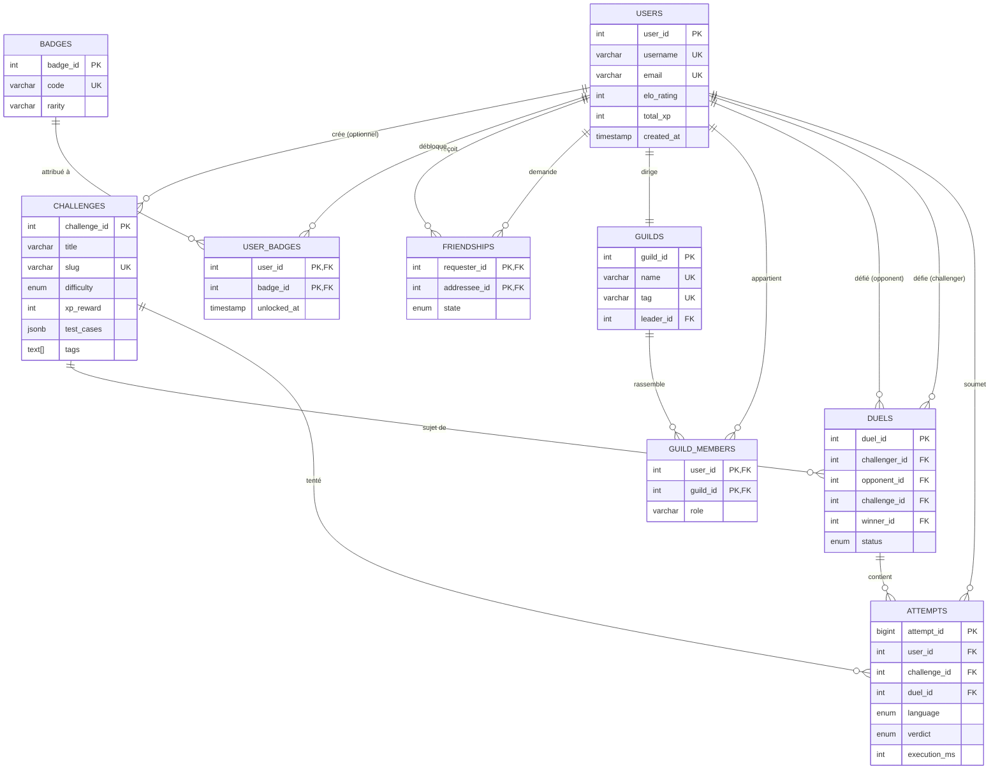

# Schéma Entité-Relation — CodeQuest

## Diagramme Mermaid

## Cardinalités résumées

| Relation | Type | Description |
|----------|------|-------------|
| User ↔ Attempt | 1-N | Un joueur peut faire plusieurs tentatives |
| User ↔ Guild | N-N | Via `guild_members` |
| User ↔ User (friendship) | N-N | Auto-référence via `friendships` |
| User ↔ User (duel) | N-N | Auto-référence via `duels` (challenger/opponent) |
| Challenge ↔ Attempt | 1-N | Un challenge a plusieurs tentatives |
| Duel ↔ Attempt | 1-N | Un duel contient les tentatives des 2 joueurs |
| User ↔ Badge | N-N | Via `user_badges` |

## Justifications des choix

### Pourquoi `friendships` avec `requester_id < addressee_id` ?
Le graphe d'amitié est **non orienté** : si Alice et Bob sont amis, peu importe qui a envoyé la demande. Stocker deux fois `(Alice→Bob)` ET `(Bob→Alice)` doublerait l'espace et compliquerait les requêtes. La contrainte `CHECK (requester_id < addressee_id)` garantit qu'on stocke chaque paire une seule fois.

### Pourquoi `JSONB` pour `test_cases` ?
Le nombre de tests par challenge varie. Stocker chaque test dans une table séparée serait coûteux en jointures. JSONB permet :
- Requêtes type `test_cases->0->>'input'`
- Index GIN sur le contenu
- Une seule lecture pour récupérer tous les tests

### Pourquoi `BIGSERIAL` pour `attempt_id` ?
Les tentatives sont l'entité la plus volumineuse (plusieurs par joueur, par jour). On anticipe le dépassement de 2^31 (~2 milliards) sur le long terme.

### Pourquoi une vue matérialisée pour le classement ?
Calculer le classement à la volée nécessite un tri sur tous les utilisateurs + jointures avec `duels`. Sur 1M de joueurs, c'est lent. La vue matérialisée pré-calcule, rafraîchie 1× par minute → réponse instantanée.

### Pourquoi `ON DELETE SET NULL` sur `challenges.author_id` ?
Si on supprime un compte, on ne veut pas perdre les challenges qu'il avait créés (utiles à la communauté). On garde le contenu en marquant l'auteur comme "anonyme".

### Pourquoi `ON DELETE CASCADE` sur `attempts.user_id` ?
Une tentative sans joueur n'a aucun sens. Le RGPD impose aussi de pouvoir tout supprimer.
